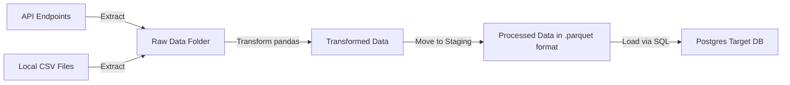

# Introduction
This ETL pipeline extracts, transforms, and loads data from multiple sources (APIs, CSVs) into a unified PostgreSQL database

## Key Features
* Automatic topological sort of insertion order with Kahn's Algorithm
* Automatic extraction of table and column names from schema file

## Database Architecture
The structure of the target database is as follows.


# Getting Started
## Prerequisites
* Docker
* Docker Compose
* [uv (manages python)](https://docs.astral.sh/uv/getting-started/installation/)

### Python Packages
* dotenv >= 0.9.9
* psycopg[binary] >= 3.2.12 (postgres)
* pandas >= 2.3.3 
* pyarrow >= 22.0.0 (to create parquet files)

## Installation
```bash
git clone https://github.com/JuFo96/ETL
cd ETL
```
Install Python dependencies with uv
```bash
uv sync
```
or with pip and venv
```
python -m venv .venv
pip install -r requirements.txt
source .venv/bin/activate # .venv/Scripts/Activate.ps1 on windows
```
The target PostgreSQL server can be started as a background process with
```bash
docker compose up -d
```
Direct access to the psql shell inside the docker container can be obtained with the following command
```bash
docker exec -it <CONTAINER NAME> psql -U <DB_USER> <DB_NAME>
```
The super user for the postgresql database is admin (defined in hardcoded env variables in `docker-compose.yaml`) 
```bash
docker exec -it pg_bikestore_db psql -U admin bikestore_db
```
DB_USER and DB_PASSWORD should be defined in a `.env` file, refer to `.env.example`. They should match the credentials defined "very securely" in `03-create_user_permissions.sql` and is `DB_USER = 'etl_app'` and `DB_PASSWORD = 'password'` for now.

Container name is defined in `docker-compose.yaml` and is `pg_bikestore_db` for now

## Configuration
* Paths to raw input files and URLs of API endpoints can be configured in `src/config.py`
* Target DB connection can be configured in `src/config.py` and a user created `.env` file, refer to `.env.example` for expected environment variables


# Running the Pipeline
The entire pipeline is orchestrated by the python script `src/main.py`, which can be executed with 
```bash
uv run src/main.py
```
The docker container hosting the sql server must be running when the script is executed. Currently the script will truncate the entire bikestore schema before uploading, when it's executed as a workaround to make it idempotent.

## Pipeline Flow



1. The pipeline will initially setup a database schema according to `sql/01-schema/`
2. While setting up the database the script will calculate the optimal insertion order based on topological sorting with Kahn's algorithm, this is defined in `src/utils.py`
3. Data is extracted from API endpoints with `src/extract.py` and written to the input folder `data/raw/api`
4. Transformations are carried out in `src/transform.py`, the ordering of if statements are hardcoded and volatile to table changes.
5. A connection to the database is created with the `src/connection.py` module, and data is inserted at once with crud operations defined in `src/table.py`

# Future work
* Add support for streaming data continously through the pipeline ala CDC (Change Data Capture), this will require some sort of db state logging
* Add python ETL script to a docker container running on scheduled intervals or on event listener basis when raw data changes
* Automate diagram generations (tbls (cli tool) -> mermaid -> .svg) seems to have promise
* Add further support for credentials and secrets, removing hardcoded credentials
* Some sort of setup.sh script to populate .env, or deploy entire pipeline with ci/cd and using github secrets or similar.
* Handle PII with locked down tables creating views etc.
* Making some sort of application to handle authentication seems like a much easier and scaleable choice rather than doing it in the database.

# Authors
Julius Foverskov: 
julius.foverskov(at)specialisterne.dk

# License
GPL 3

