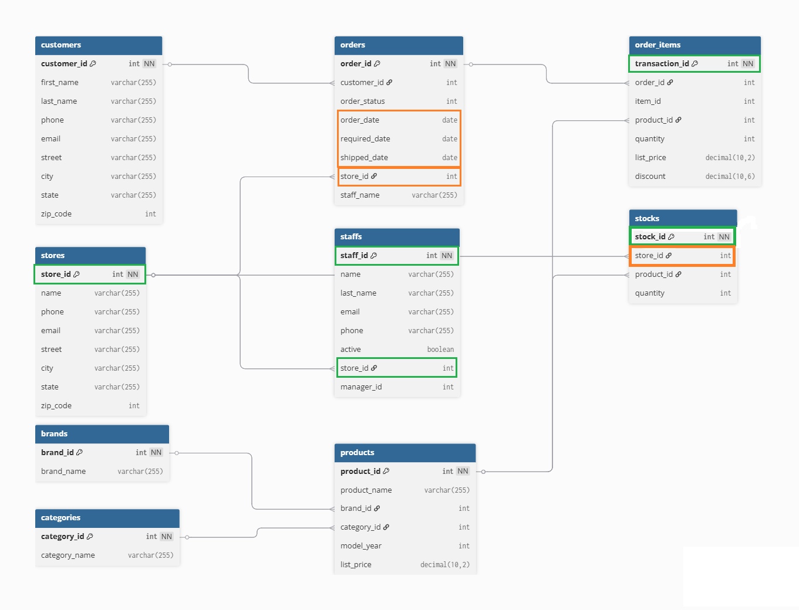

# Introduction
This ETL pipeline extracts, transforms, and loads data from multiple sources (APIs, CSVs, and a local database) into a unified MySQL database

## Key Features
* Automatic topological sort of insertion order with Kahn's Algorithm
* Automatic extraction of table and column names from schema file


## Database Architecture
The structure of the target database is as follows.



# Getting Started
## Prerequisites
* Docker
* Docker Compose
* [uv (manages python)](https://docs.astral.sh/uv/getting-started/installation/)

### Python Packages
* mysql-connector-python >= 9.4.0
* pandas >= 2.3.3

## Installation
```bash
git clone https://github.com/JuFo96/ETL
cd ETL
```
Install Python dependencies with uv
```bash
uv sync
```
or with pip and venv
```
python -m venv .venv
pip install -r requirements.txt
source .venv/bin/activate # ./venv/Scripts/activate on windows
```
The target MySQL server can be started as a background process with
```bash
docker compose up -d
```
Direct access to the mysql shell inside the docker container can be obtained with the following command
```bash
docker exec -it <CONTAINER NAME> mysql -u root -p
```
* Password is defined in `src/config.py` and `docker-compose.yaml` and is "password" for now.
* Container name is defined in `docker-compose.yaml` and is test_integrated_db for now
* If main doesn't run you should possibly create DB manually inside mysql shell with
```
CREATE DATABASE integrated_db;
``` 
## Configuration
* Paths to raw input files and URLs of API endpoints can be configured in `src/config.py`
* Target DB connection can be configured in `src/config.py`
* TODO - ENV variables (.env/docker compose)


# Running the Pipeline
* The entire pipeline is orchestrated by the python script `src/main.py`, a prerequisite is having the mysql docker container running. 


## Pipeline Flow


1. The pipeline will initially setup a database schema according to `sql/schema/baseline_integrated_db.sql`
2. While setting up the database the script will calculate the optimal insertion order based on topological sorting with Kahn's algorithm, this is defined in `src/utils.py`
3. Data is extracted from API endpoints with `src/extract.py` and written to the input folder `data/raw/api`
4. Transformations are carried out in `src/transform.py`, currently only raw data containing date data are transferred from dd-mm-yyyy format to yyy-mm-dd format.
5. A connection to the database is created with the `src/connection.py` module, and data is inserted at once with crud operations defined in `src/table.py`

# Future work
* Add support for streaming data continously through the pipeline ala CDC (Change Data Capture), this will require some sort of db state logging
* Add python ETL script to a docker container running on scheduled intervals or on event listener basis when raw data changes
* Automate diagram generations 
* Add support for credentials with either env variables or secrets?

# Authors
Julius Foverskov: 
julius.foverskov(at)specialisterne.dk

# License
GPL 3

