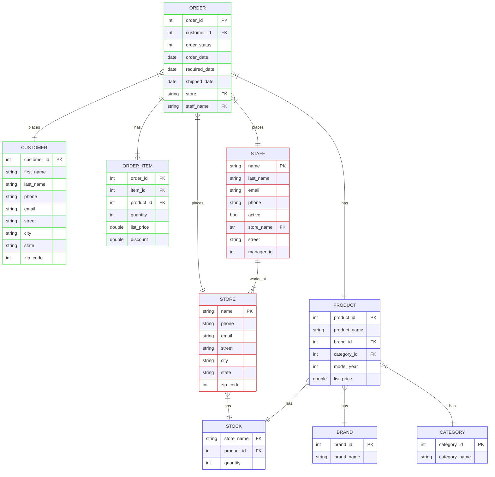
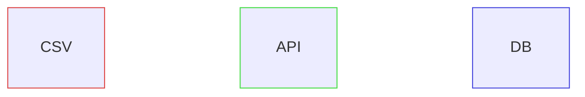

## ER diagram for source data

```mermaid
erDiagram

    classDef csv stroke:#d44

    classDef api stroke:#4d4

    classDef sql stroke:#44d

    CUSTOMER:::api
    ORDER:::api
    ORDER_ITEM:::api

    STAFF:::csv
    STORE:::csv

    BRAND:::sql
    CATEGORY:::sql
    PRODUCT:::sql
    STOCK:::sql

    ORDER }|--|| CUSTOMER : places
    ORDER }|--|| STAFF : places
    ORDER }|--|| STORE : places
    ORDER }|--|| PRODUCT : has
    ORDER ||--|{ ORDER_ITEM : has

    STAFF ||--|{ STORE : works_at

    PRODUCT }|--|| BRAND : has
    PRODUCT }|--|| CATEGORY : has
    STORE }|--|| STOCK : has
    PRODUCT }|--|| STOCK : has


    CUSTOMER {
        int customer_id PK
        string first_name
        string last_name
        string phone
        string email
        string street
        string city
        string state
        int zip_code
    }

    ORDER {
        int order_id PK
        int customer_id FK
        int order_status
        date order_date
        date required_date
        date shipped_date
        string store FK
        string staff_name FK
    }

    ORDER_ITEM {
        int order_id FK
        int item_id FK
        int product_id FK
        int quantity
        double list_price
        double discount
    }
    
    STORE {
        string name PK
        string phone
        string email
        string street
        string city
        string state
        int zip_code
    }

    STAFF {
        string name PK
        string last_name
        string email
        string phone
        bool active
        str store_name FK
        string street
        int manager_id
    }

    BRAND {
        int brand_id PK
        string brand_name
    }

    CATEGORY {
        int category_id PK
        string category_name
    }

    PRODUCT {
        int product_id PK
        string product_name
        int brand_id FK
        int category_id FK
        int model_year
        double list_price
    }

    STOCK {
        string store_name FK
        int product_id FK
        int quantity
    }
```

### Key

```mermaid
erDiagram

    classDef csv stroke:#d44

    classDef api stroke:#4d4

    classDef sql stroke:#44d

    CSV:::csv
    API:::api
    DB:::sql
```